--- 
layout: default
---

# Building

The following is documentation for those who would like to build and install the Zalf Mujadarra App. 

## Prerequisites

- XCode 14.1+ : [download here](https://developer.apple.com/xcode/)
- an icloud account ie, someone@icloud.com (or the willingness to create one)
- an iOS Device with iOS 16.1.2+
- a lightning cable to plug it into your computer from where you are building from
- admin access to the computer you are working on

## Building

1. Download the XCode project here: 
2. Navigate to the project folder and open the `.xcodeproj` file 
3. Focus on (select) the project root 

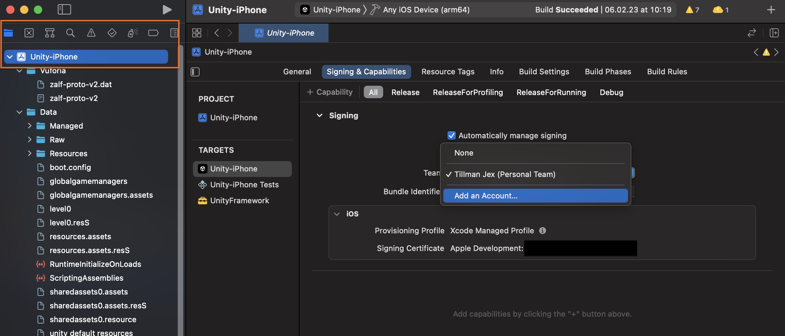

4. Click 'Signing & Capabilities' > "automatically manage signing" > confirm > team > add an account

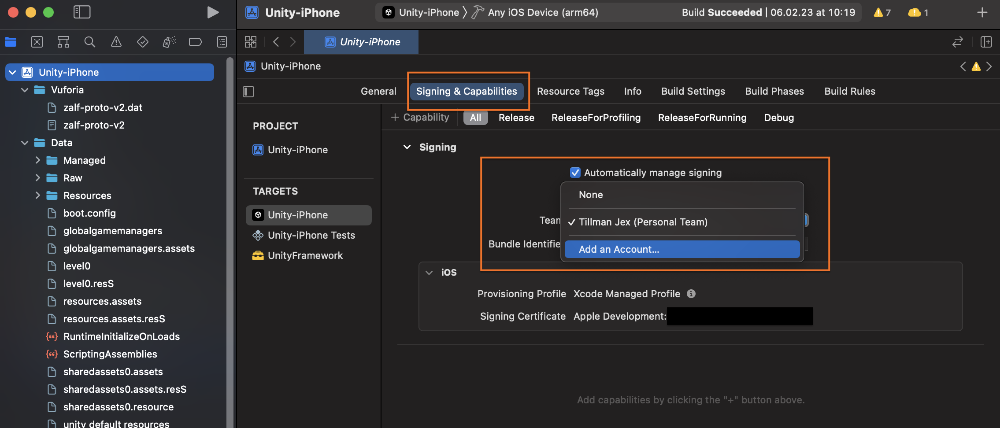

5. Add an account by clicking the '+' button, button left

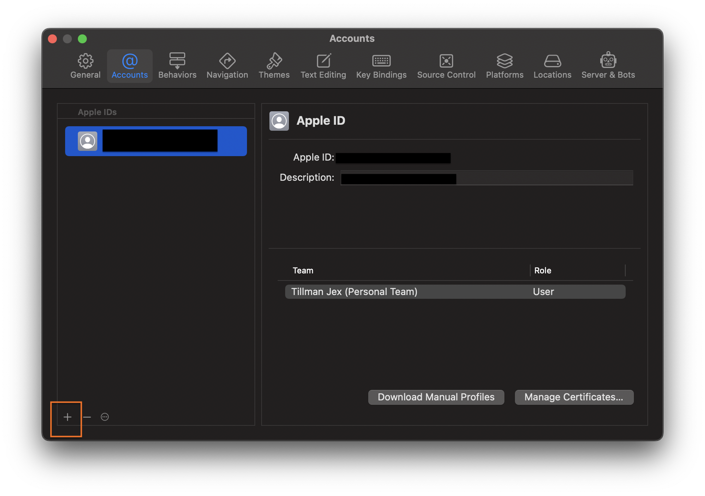

6. Sign in to your icloud account or create one if needed

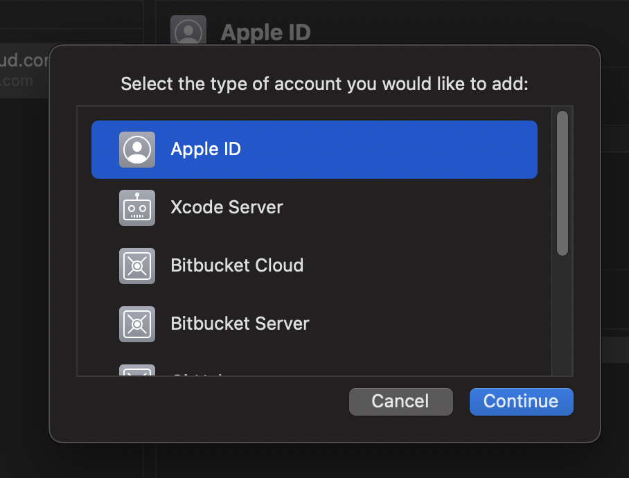

7. Click 'Manage Certificates...'

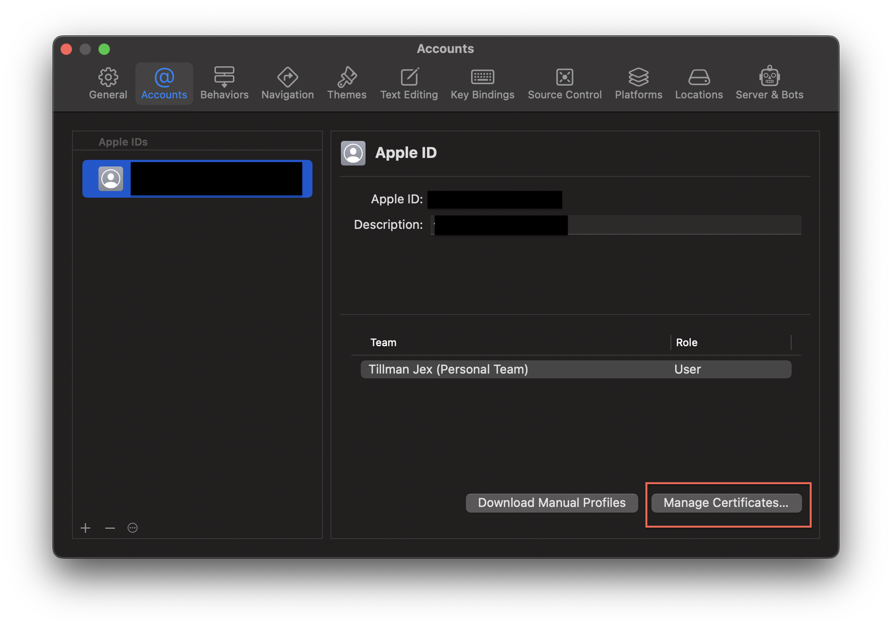

8. Add a new certificate by clicking on the '+' button, bottom left

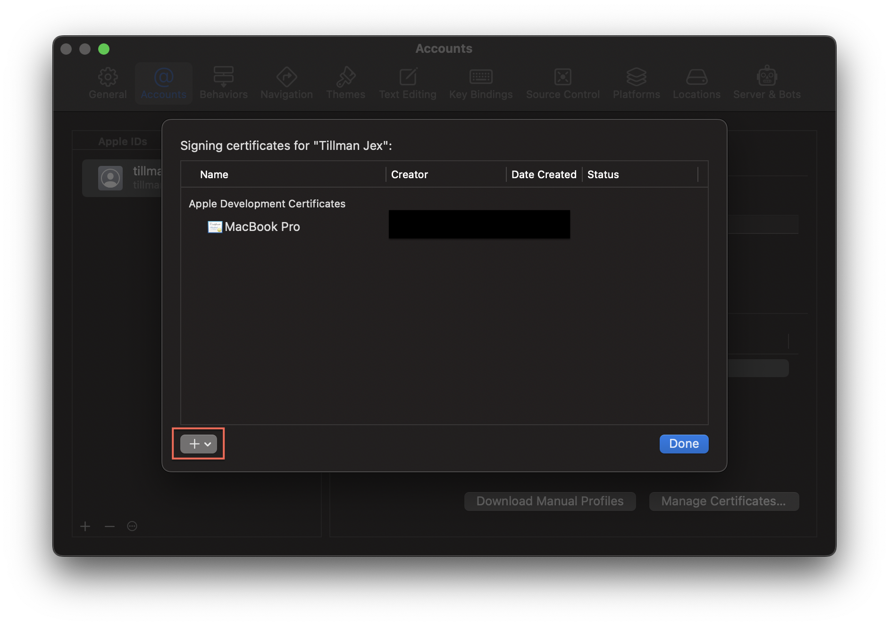

9. Click done

10. Plug your iOS Device in to to your computer and select it as a build target

11. Click the 'play' button

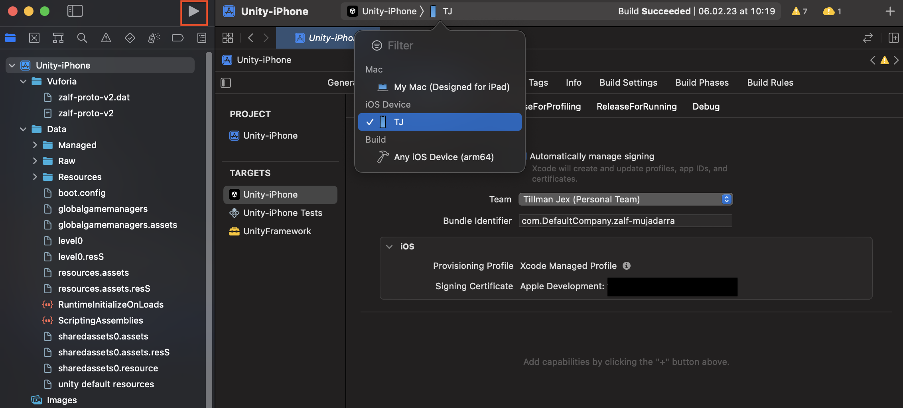

If you receive this pop-up message, simply autheticate with your computer's password.   
This is a security step so that others cannot sign an app with your certificate. 

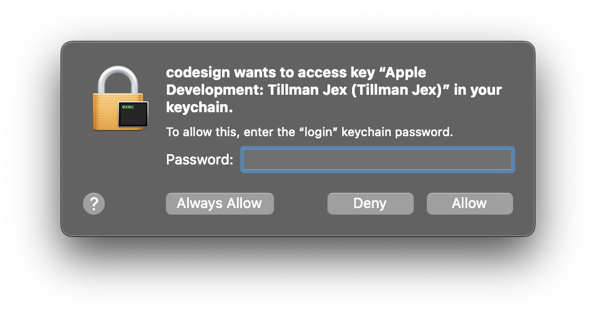

At this stage, XCode will build and install the app to your phone.   
Note, it is normal to see a lot of 'warning' messages in the XCode UI.

12. You may get a pop up message in XCode directing you to unlock your device

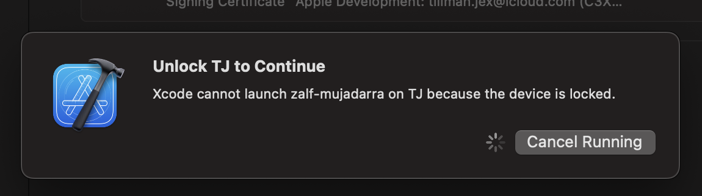

13. Do so by entering your normal unlock code via your iOS Device. 

The first time you run the app, you will receive a pop-up warning titled "Untrusted Developer" and also 
a pop-up in XCode itself. 

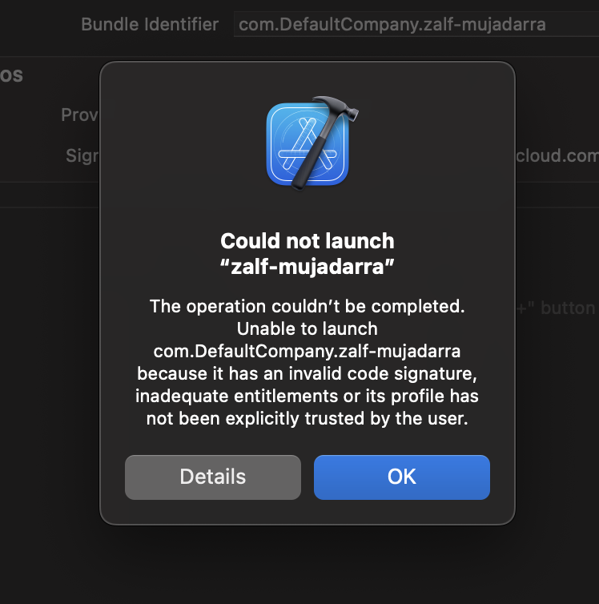

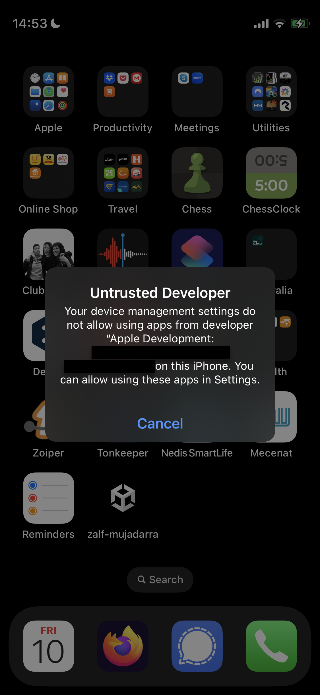

This is expected and a normal security feature of iOS. Complete the following steps: 

14. (As of iOS 16) on your iOS device, navigate to: settings > privacy & security and switch developer mode on
15. Then navigate to: settings > general > VPN & Device Management > Developer App (Heading) and trust your developer account

Now the App on your iOS device can be launched. Head back to the app and launch it like you would any other app.   
At this point you can disconnect the iOS device from your computer. XCode will complain about it, but no functionality 
has been damaged. The app can now be run anywhere, any time. 
