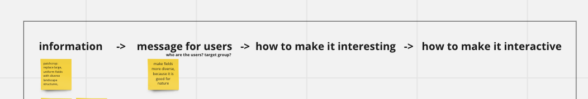
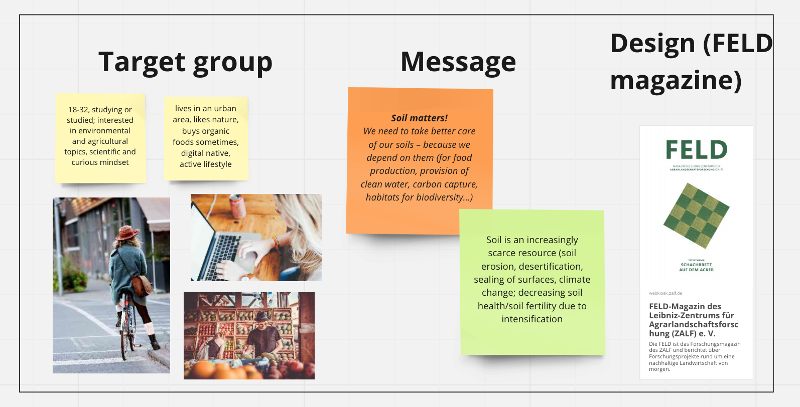
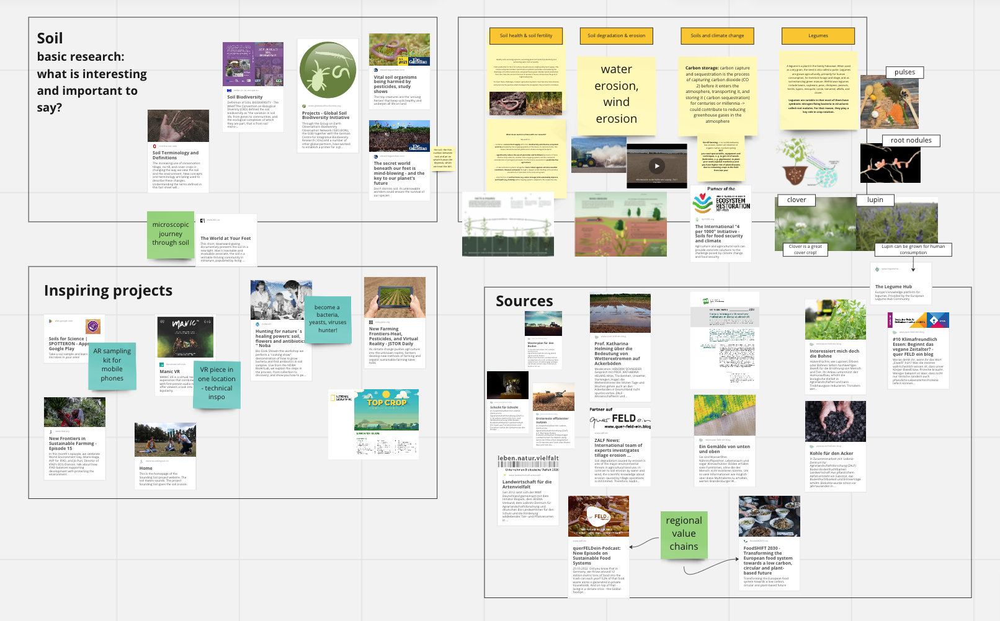
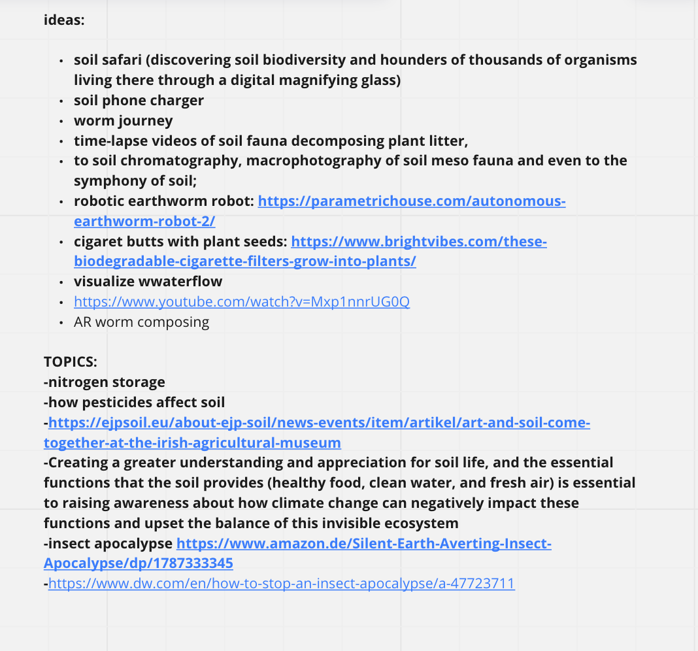
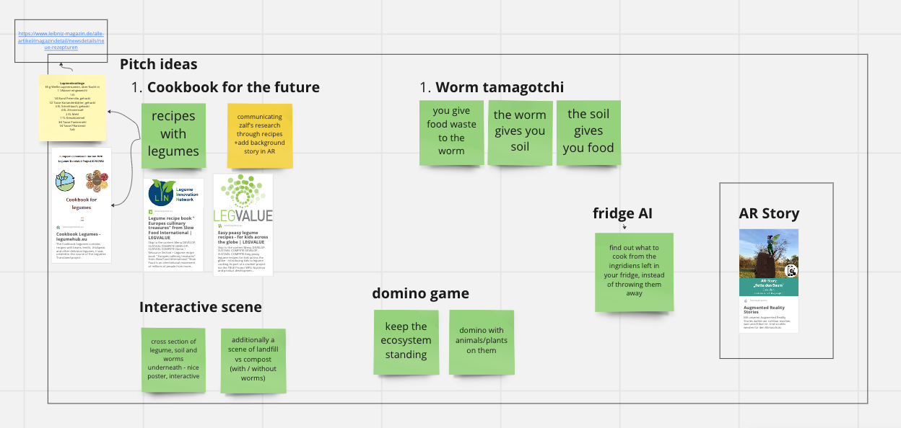
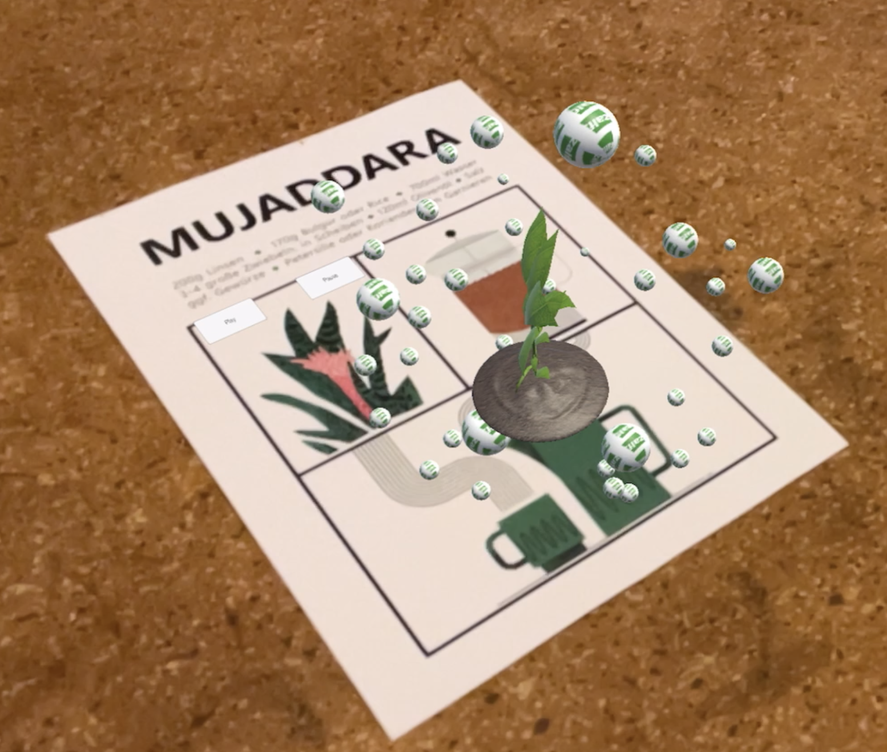

# Documentation

## Table of Contents

- [Introduction](#introduction)
- [Afterthoughts](#afterthoughts)
- [Concept Development](#concept-development)
    - [Target User Persona](#target-user-persona)
    - [Message](#message)
    - [Pitch Ideas](#pitch-ideas)
- [Design process](#design-process)
    - [Scriptwriting](#scripwriting)
    - [Visual Design](#visual-design)
- [Technical Implementation](#technical-implementation)
    - [A Technical Summary](#a-technical-summary)
    - [Image Target Implementation](#image-target-implementation)
    - [Audio Implementation](#audio-implementation)
    - [Building and Testing](#building-and-testing)


## Introduction 

While designing an app for ZALF, we were faced with a difficult task of delivering complex research in a straightforward, amusing format. We  wanted to communicate ZALF’s scientific research in a playful, immersive way that would attract young audiences. 
We decided to use technology to allow the users to become part of the story. Thanks to this approach the person using our app isn’t just a passive observer, but the center of the narrative.

## Afterthoughts

Based on the prototype as seen in the [demo](demo), below are some dot-points identifying what we would improve.

- less markers on the page, creating less clutter and difficulty for the AR engine
- markers that have auto-play content should be on their own page so that other elements of the app are not interupted accidentally
- audio UI should have a play head to visualise how long the audio file is

## Concept Development
First asked ZALF’s team what they wanted to communicate and to whom. Based on this information we came up with a concept. 


### Target User Persona
We started from deciding on our target group. After a couple of conversations, it was clear that even though ZALF’s message is universal, it would be impossible to design an experience for everyone. 
Our design persona lives in a big city, is young, well educated and already interested in ecological sustainability. We call her Alexa. Alexa has studied in Berlin, now is working her first job. She buys in bio supermarkets, but when she thinks about it, she doesn’t really know what is the difference between “organic” and “demeter”. She doesn’t know if it really makes any difference and when it would. Alexa would like to make informed choices, but doesn’t have time to read long publications. She likes streaming series, meeting friends, cooking, eating out, listening to podcasts and audiobooks.
 

### Message
Together with ZALF we decided on a crucial message that we wanted to communicate. The message was: “Soil matters!”. While researching and exchanging ideas, we found out that soil influences almost everything around us - soil is important when we talk about subjects like food production, climate change, provision of clean water, biodiversity, etc. 

Based on ZALF’s research, we initially explored four subjects that we have found the most interesting as a base of  an interactive experience:
- Soil health & soil fertility
- Soil degradation & erosion
- Soils and climate change
- Legumes
 

### Pitch ideas
We came up with 5 ideas for interactive projects that we have pitched to ZALF teams. ZALF has decided on an “interactive cooking experience” that we have developed further. 
 
 

## Design Process

Our interactive cooking experience is inspired by location-based audio walks. Experiences with added audio layer are really transportive for the listener. 

Our cooking experience is designed for everyone's kitchen. We add interactive listening and AR layers to the physical world, illuminating stories hidden in the ingredients and dishes prepared. We would like to indulge curiosity, as our experience has the potential to completely reimagine how we process our surroundings both old and new, bringing the past, present, and future of spaces to life simultaneously.

### Scriptwriting
We decided to base our cooking experience on legumes-rich recipe for mujaddra. We have started with writing a script for the audio layer for the app. We wanted it to be informative and entertaining. We have succeeded in delivering the message about the importance of changing our diet to one rich in legumes, while keeping light, playful tone. 

### Visual Design
Based on the script, we have designed the recipe page with markers for the AR app. 
For the graphics to work well as markers, we had to keep in mind to create illustrations with many tiny details and high contrast, so the AR app can easily identify them. 
 


## Technical Implementation

An early concept and technical test:   


### A Technical Summary

The technical implementation involved the following general processes: 
- importing the imagery and animations into Unity
- creating the user interface mechanics of the audio controls
- programming rules into the AR program to control the quality of user experience
- building and testing the application in various lighting conditions

The Zalf Mujaddara AR app uses three main technologies: Unity, Vuforia and Xcode.   
In short, the application works by instructing the application to perform a given 
action upon the camera 'seeing' what's called an 'image target'. 

An image target is a visual element on the printed page, that we would like to have 
AR enabled. This meaning, that the user can view the printed image via their phone's camera, 
at which point the associated AR content will be shown on their screen. 


### Image Target Implementation

The afore mentioned process is achieved using the 3d engine, Unity.    
Below is a screencapture of the image targets along with the paired AR content, arranged in Unity. 


Within Unity runs Vuforia, the engine which takes care of specific components of the AR functionality, 
such as image target recognition and AR content presentation. As an initial stage of image target 
preparation, the visual images destined to be image targets, need to be analysed by an online 
system. This process creates a graphical 'map' of the image, which the Vuforia engine in Unity 
uses to interpret whether it is seeing something it recognises or not. 

Below you can see an example of a section of page that is destined to become an image target. 
The image after it shows the resulting 'map' that the online Vuforia system has calculated. 
As mentioned this 'map' allows the engine running in Unity to not only be able to identify 
what it's seeing as an iamge target, but also to differentiate it from other image targets. 


### Audio Implementation

The audio playback in the Zalf Mujadarra App followed the below steps:

- recording the audio
- post-processing of audio in Cubase (to make it sound better)
- importing the audio into Unity and assigning to image targets
- writing c# scripts to:
    - control logic to allow playback of only one file at a time 
    - control audio time skipping backwards / forwards 
    - allow the user interactable buttons to control the audio playback

The following image shows the script below in use within Unity. 
What's happening is:
- audio srouces from the Unity environment (ie the narration) are imported in the 'Audio Sources' list,
- the toggle buttons on each audio UI panel are importated into the 'Toggle Buttons' list,
- the lentil / world animation is imported into 'World Animation' and,
- the images for play / pause are imported into 'On Sprite' and 'Off Sprite'

All of these elements are then programmatically controlled in the below script to achieve two main functionalities:
1. When an audio element gets played, all other audio elements stop
2. When the image target for the lentil / world animation gets seen, all other audio elements stop

```c#
using System.Collections;
using System.Collections.Generic;
using UnityEngine;
using UnityEngine.UI;

public class audio_system_control : MonoBehaviour
{
    public AudioSource[] audioSources;
    public Toggle[] toggleButtons;
    public AudioSource worldAnimation;
    public Sprite onSprite;
    public Sprite offSprite;

    private bool[] isPlaying;

    private void Start()
    {
        // Initialize isPlaying array
        isPlaying = new bool[audioSources.Length];

        // Add toggle function to each button
        for (int i = 0; i < toggleButtons.Length; i++)
        {
            int index = i; // Create a copy of i for use in the listener
            toggleButtons[i].onValueChanged.AddListener((value) => TogglePlayPause(index, value));
        }
    }

    public void worldDisplayed()
    {

            // Stop all other audio sources before playing
            for (int i = 0; i < audioSources.Length; i++)
            {
                    audioSources[i].Stop();
                    // Change the image of the other toggle buttons to offSprite
                    toggleButtons[i].GetComponentInChildren<Image>().sprite = offSprite;
            }
    }

    private void TogglePlayPause(int index, bool value)
    {
        if (!value)
        {
            worldAnimation.Stop();
            // Stop all other audio sources before playing
            for (int i = 0; i < audioSources.Length; i++)
            {
                if (i != index)
                {
                    audioSources[i].Stop();
                    // Change the image of the other toggle buttons to offSprite
                    toggleButtons[i].GetComponentInChildren<Image>().sprite = offSprite;
                }
            }
            // Play audio and set isPlaying to true
            audioSources[index].Play();
            isPlaying[index] = true;
            // Change the image of the selected toggle button to onSprite
            toggleButtons[index].GetComponentInChildren<Image>().sprite = onSprite;
        }
        else
        {
            // Pause audio and set isPlaying to false
            audioSources[index].Pause();
            isPlaying[index] = false;
            // Change the image of the selected toggle button to offSprite
            toggleButtons[index].GetComponentInChildren<Image>().sprite = offSprite;
        }
    }
}
```
### Building and Testing

If you would like to build the project onto iOS yourself, please see the [building page](building).

Building and testing is a process of exporting the Unity project to an Xcode
project, opening the project in Xcode and exporting to a target iOS device upon when the AR app 
can be tested with the intended hardware.

Apart from some initial bugs due to version incompatibilty between the target iOS device, Unity and Xcode, 
the process was very smooth and painless. Below is an early test of the AR system. The final product is presented 
on the [demo](demo) page.


[def]: #process-introduction