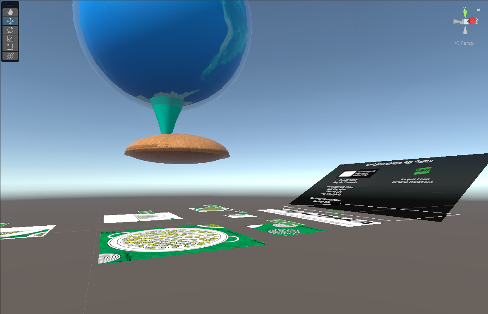
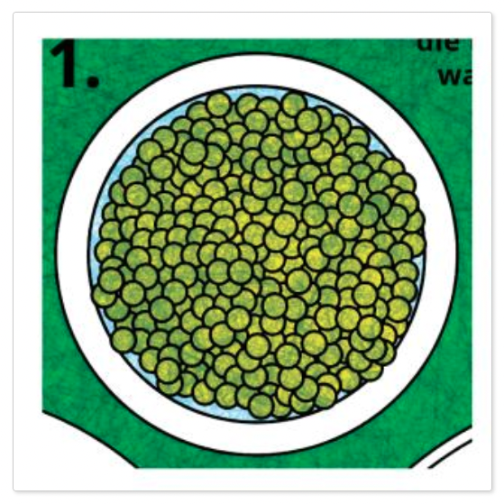
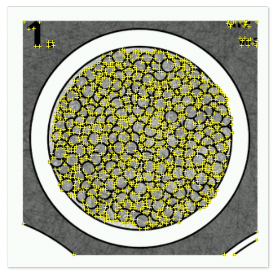

# Process

Documentation on the process

## Technical Implementation

### A Technical Summary

The technical implementation involved the following general processes: 
- importing the imagery and animations into Unity
- creating the user interface mechanics of the audio controls
- programming rules into the AR program to control the quality of user experience
- building and testing the application in various lighting conditions

The Zalf Mujaddara AR app uses three main technologies: Unity, Vuforia and Xcode.   
In short, the application works by instructing the application to perform a given 
action upon the camera 'seeing' what's called an 'image target'. 

An image target is a visual element on the printed page, that we would like to have 
AR enabled. This meaning, that the user can view the printed image via their phone's camera, 
at which point the associated AR content will be shown on their screen. 


### Image Target Implementation Process

The afore mentioned process is achieved using the 3d engine, Unity.    
Below is a screencapture of the image targets along with the paired AR content, arranged in Unity. 



Within Unity runs Vuforia, the engine which takes care of specific components of the AR functionality, 
such as image target recognition and AR content presentation. As an initial stage of image target 
preparation, the visual images destined to be image targets, need to be analysed by an online 
system. This process creates a graphical 'map' of the image, which the Vuforia engine in Unity 
uses to interpret whether it is seeing something it recognises or not. 

Below you can see an example of a section of page that is destined to become an image target. 
The image after it shows the resulting 'map' that the online Vuforia system has calculated. 
As mentioned this 'map' allows the engine running in Unity to not only be able to identify 
what it's seeing as an iamge target, but also to differentiate it from other image targets. 





### Audio Implementation Process

The audio playback in the Zalf Mujadarra App followed the below steps:

- recording the audio
- post-processing of audio in Cubase (to make it sound better)
- importing the audio into Unity and assigning to image targets
- writing c# scripts to:
    - control logic to allow playback of only one file at a time 
    - control audio time skipping backwards / forwards 
    - allow the user interactable buttons to control the audio playback

The following image shows the script below in use within Unity. 
What's happening is:
- audio srouces from the Unity environment (ie the narration) are imported in the 'Audio Sources' list,
- the toggle buttons on each audio UI panel are importated into the 'Toggle Buttons' list,
- the lentil / world animation is imported into 'World Animation' and,
- the images for play / pause are imported into 'On Sprite' and 'Off Sprite'

All of these elements are then programmatically controlled in the below script to achieve two main functionalities:
1. When an audio element gets played, all other audio elements stop
2. When the image target for the lentil / world animation gets seen, all other audio elements stop

```c#
using System.Collections;
using System.Collections.Generic;
using UnityEngine;
using UnityEngine.UI;

public class audio_system_control : MonoBehaviour
{
    public AudioSource[] audioSources;
    public Toggle[] toggleButtons;
    public AudioSource worldAnimation;
    public Sprite onSprite;
    public Sprite offSprite;

    private bool[] isPlaying;

    private void Start()
    {
        // Initialize isPlaying array
        isPlaying = new bool[audioSources.Length];

        // Add toggle function to each button
        for (int i = 0; i < toggleButtons.Length; i++)
        {
            int index = i; // Create a copy of i for use in the listener
            toggleButtons[i].onValueChanged.AddListener((value) => TogglePlayPause(index, value));
        }
    }

    public void worldDisplayed()
    {

            // Stop all other audio sources before playing
            for (int i = 0; i < audioSources.Length; i++)
            {
                    audioSources[i].Stop();
                    // Change the image of the other toggle buttons to offSprite
                    toggleButtons[i].GetComponentInChildren<Image>().sprite = offSprite;
            }
    }

    private void TogglePlayPause(int index, bool value)
    {
        if (!value)
        {
            worldAnimation.Stop();
            // Stop all other audio sources before playing
            for (int i = 0; i < audioSources.Length; i++)
            {
                if (i != index)
                {
                    audioSources[i].Stop();
                    // Change the image of the other toggle buttons to offSprite
                    toggleButtons[i].GetComponentInChildren<Image>().sprite = offSprite;
                }
            }
            // Play audio and set isPlaying to true
            audioSources[index].Play();
            isPlaying[index] = true;
            // Change the image of the selected toggle button to onSprite
            toggleButtons[index].GetComponentInChildren<Image>().sprite = onSprite;
        }
        else
        {
            // Pause audio and set isPlaying to false
            audioSources[index].Pause();
            isPlaying[index] = false;
            // Change the image of the selected toggle button to offSprite
            toggleButtons[index].GetComponentInChildren<Image>().sprite = offSprite;
        }
    }
}
```
### Building and Testing

Building and testing is a process of exporting the Unity project to an [Xcode](https://developer.apple.com/xcode/) 
project, opening the project in Xcode and exporting to a target iOS device upon when the AR app 
can be tested with the intended hardware.

Apart from some initial bugs due to version incompatibilty between the target iOS device, Unity and Xcode, 
the process was very smooth and painless. Below is an early test of the AR system. The final product is presented 
on the [demo](demo) page.


